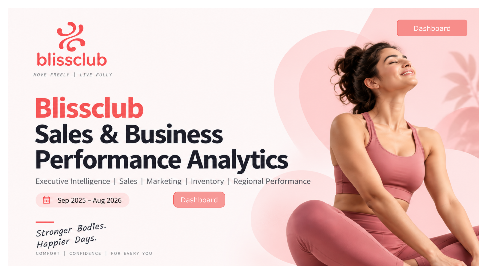
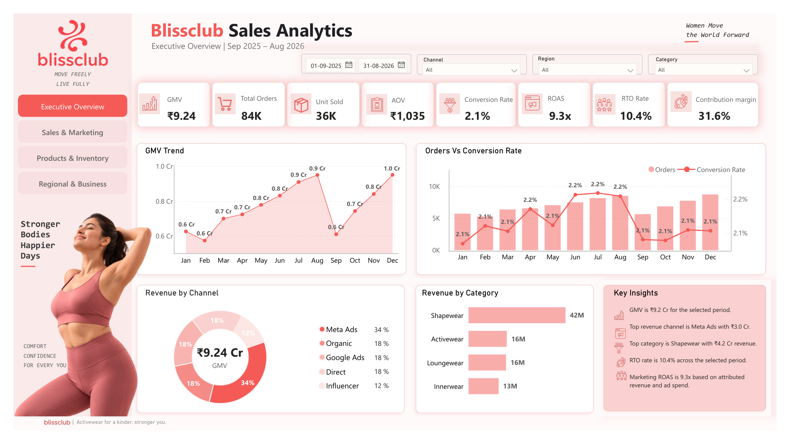
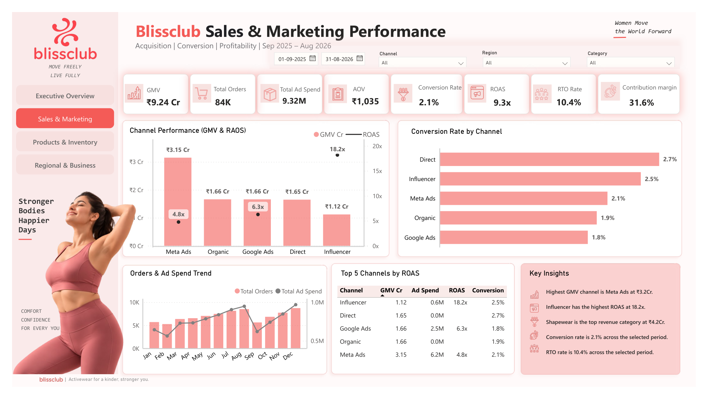
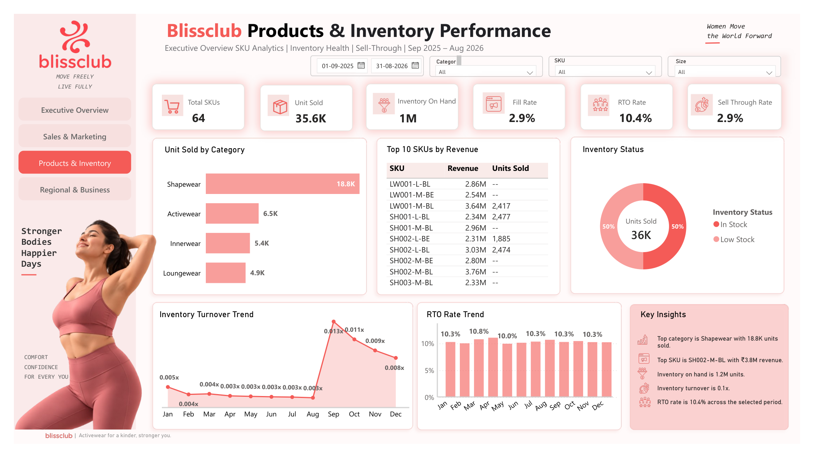
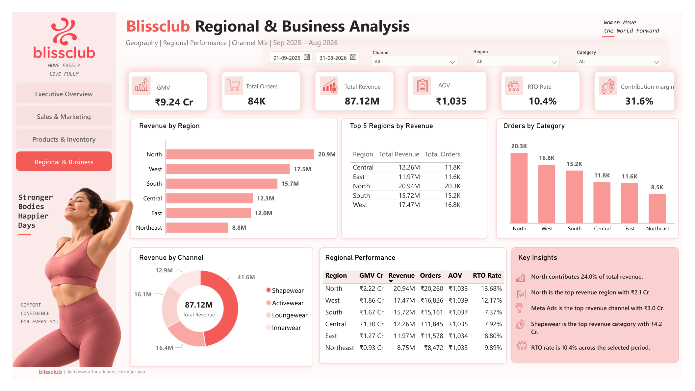

<div align="center">

# 🩱 Blissclub — Sales & Business Performance Analytics
### Power BI Dashboard | D2C Activewear Brand

**Executive Intelligence · Sales & Marketing · Inventory · Regional Performance**

📅 Reporting Period: **Sep 2025 – Aug 2026**

[](https://app.powerbi.com/view?r=eyJrIjoiY2E2OGU1ZGQtM2NhNC00NzA0LWFkODEtMWFiNzY5Njc0ZmE4IiwidCI6ImM5YzUwODQ4LWIwM2EtNGJlNC1iNjU1LTZlZGQ3ZmI4MWM1YSJ9)


</div>

---

---

## 🔗 Live Dashboard

👉 **[Click here to open the interactive Power BI dashboard](https://app.powerbi.com/view?r=eyJrIjoiY2E2OGU1ZGQtM2NhNC00NzA0LWFkODEtMWFiNzY5Njc0ZmE4IiwidCI6ImM5YzUwODQ4LWIwM2EtNGJlNC1iNjU1LTZlZGQ3ZmI4MWM1YSJ9)**

> Tip: The live dashboard is fully interactive — use the **Channel / Region / Category** slicers and the date filter to explore the data yourself.

---

## 📖 About the Project

This project is an **end-to-end sales & business performance dashboard** built for **Blissclub**, a D2C activewear brand, covering a full 12-month period (Sep 2025 – Aug 2026).

The dashboard consolidates raw transactional, marketing, inventory and regional data into **4 interactive pages** that give leadership a single source of truth for tracking growth, profitability, marketing efficiency, and stock health.

**Business questions this dashboard answers:**
- How is GMV, revenue, and contribution margin trending month over month?
- Which marketing channel drives the most revenue vs. the most efficient ROAS?
- Which product categories and SKUs are top sellers — and which are at risk of stockouts?
- Which regions are driving growth, and where is RTO (Return-to-Origin) eating into margin?

---

## 🖼️ Dashboard Preview

### Cover Page


<br>

### 1️⃣ Executive Overview
High-level KPIs — GMV, Orders, AOV, Conversion Rate, ROAS, RTO Rate, and Contribution Margin — with GMV trend, revenue by channel, and revenue by category.



<br>

### 2️⃣ Sales & Marketing Performance
Channel-level acquisition, conversion, and profitability — GMV & ROAS by channel, conversion rate by channel, orders vs. ad spend trend, and the Top 5 Channels by ROAS leaderboard.



<br>

### 3️⃣ Products & Inventory Performance
SKU-level analytics — units sold by category, Top 10 SKUs by revenue, inventory status, inventory turnover trend, and RTO rate trend.



<br>

### 4️⃣ Regional & Business Analysis
Geographic breakdown — revenue by region, revenue by channel, orders by category, and a full regional performance table (GMV, Revenue, Orders, AOV, RTO Rate).



---

## 📊 Key Metrics Tracked

| Metric | Value (Sep 2025 – Aug 2026) |
|---|---|
| GMV | ₹9.24 Cr |
| Total Orders | 84K |
| Units Sold | 36K |
| AOV | ₹1,035 |
| Conversion Rate | 2.1% |
| Marketing ROAS | 9.3x |
| RTO Rate | 10.4% |
| Contribution Margin | 31.6% |

---

## 🗂️ Repository Structure

```
blissclub-sales-analytics/
│
├── README.md                          # Project documentation (this file)
│
├── assets/
│   └── screenshots/                   # Dashboard page exports (PNG)
│       ├── 00_cover.png
│       ├── 01_executive_overview.png
│       ├── 02_sales_marketing.png
│       ├── 03_products_inventory.png
│       └── 04_regional_business.png
│
├── dataset/
│   └── Brand_D2C_Illustrative_Dataset.xlsx   # Source data (illustrative)
│
└── dashboard/
    └── Blissclub_Sales_Business_Performance_Analytics.pdf   # Exported report
```

---

## 🧮 Dataset Overview

The workbook `dataset/Brand_D2C_Illustrative_Dataset.xlsx` is an **illustrative D2C sales dataset** with the following sheets:

| Sheet | Description | Columns |
|---|---|---|
| `Sales` | Order-level transactional data | Date, Order ID, Region, Channel, Category, SKU, Size, Color, Units, GMV, Discount, Revenue, RTO Flag, Return Flag, Delivered Flag, Ad Spend, Product Cost, Shipping Cost, Payment Fee, Packaging Cost |
| `Product Master` | SKU/product catalog | SKU, Base SKU, Product, Category, Size, Color, List Price, Product Cost |
| `Marketing` | Daily channel spend & attribution | Date, Channel, Ad Spend, Attributed Revenue, Orders, ROAS |
| `Traffic` | Daily site traffic by channel | Date, Channel, Website Visitors, Orders, Conversion Rate |
| `Inventory` | Daily stock ledger by SKU/region | Date, Region, SKU, Opening Stock, Received Units, Units Sold, Closing Stock |
| `Forecast vs Actual` | Demand planning accuracy | Month, Region, Category, Actual Units, Forecast Units, Variance Units, Variance % |
| `SKU Summary` | Rolled-up SKU performance | Category, SKU, Size, Color, Orders, Units, GMV, Revenue, RTO Orders, Returns, RTO %, AOV |
| `Monthly KPI` | Month-over-month business summary | Month, Orders, Units, GMV, Revenue, Discounts, Ad Spend, Product Cost, Shipping Cost, Payment Fee, Packaging Cost, RTO Orders, Returns, Delivered Orders, AOV, RTO %, Contribution, Contribution Margin % |

> This is a raw, illustrative dataset provided for building the dashboard. It does not include any Power BI DAX measures or formulas — those live inside the `.pbix` model.

---

## 🛠️ Tools & Tech Stack

- **Power BI Desktop / Power BI Service** — dashboard build & hosting
- **Microsoft Excel** — source data
- **Power Query** — data shaping and transformation

---

## 🚀 How to Explore

1. **Fastest way:** Click the [live dashboard link](https://app.powerbi.com/view?r=eyJrIjoiY2E2OGU1ZGQtM2NhNC00NzA0LWFkODEtMWFiNzY5Njc0ZmE4IiwidCI6ImM5YzUwODQ4LWIwM2EtNGJlNC1iNjU1LTZlZGQ3ZmI4MWM1YSJ9) above and interact with the filters directly in your browser.
2. **To review the data:** open `dataset/Brand_D2C_Illustrative_Dataset.xlsx`.
3. **To review the static report:** open `dashboard/Blissclub_Sales_Business_Performance_Analytics.pdf`.

---

## 👤 Author
Ishwari Attarde
LinkedIn: https://www.linkedin.com/in/ishwariattarde/

Built as a portfolio project showcasing end-to-end BI dashboard design — from raw data to an executive-ready, multi-page Power BI report.
